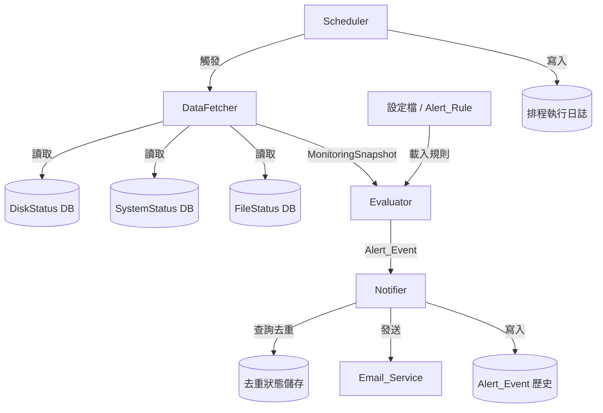

# 設計文件：告警通知系統（Alert Notification System）

## 概覽

告警通知系統（Alert Notification System）是一套定期輪詢多個監控資料庫、依規則評估資料狀態、並在偵測到異常時自動發送 E-mail 通知的後端服務。

系統從三個資料庫（DiskStatus、SystemStatus、FileStatus）的 CheckList 表讀取最新快照，透過可設定的告警規則（Alert_Rule）進行評估，產生告警事件（Alert_Event）後由通知器（Notifier）發送 E-mail 給指定收件人（Recipient）。系統同時具備防重複通知機制與完整的可觀測性日誌。

### 設計目標

- 低耦合：資料讀取、規則評估、通知發送三個核心流程相互獨立，可單獨測試與替換。
- 可設定：告警規則透過設定檔管理，無需修改程式碼即可調整閾值與收件人。
- 可靠性：資料庫連線失敗不影響其他資料來源；E-mail 發送失敗具備重試機制。
- 防重複：同一告警事件對同一收件人僅發送一次通知。

---

## 架構

系統採用排程驅動的管線（Pipeline）架構，每個排程週期依序執行以下四個階段：

```
┌─────────────────────────────────────────────────────────────────┐
│                        排程觸發器 (Scheduler)                    │
└───────────────────────────┬─────────────────────────────────────┘
                            │ 每個週期觸發
                            ▼
┌─────────────────────────────────────────────────────────────────┐
│                     資料讀取器 (DataFetcher)                     │
│  DiskStatus.CheckList │ SystemStatus.CheckList │ FileStatus.*   │
└───────────────────────────┬─────────────────────────────────────┘
                            │ 原始監控資料
                            ▼
┌─────────────────────────────────────────────────────────────────┐
│                      評估器 (Evaluator)                          │
│           載入 Alert_Rule → 比對資料 → 產生 Alert_Event          │
└───────────────────────────┬─────────────────────────────────────┘
                            │ Alert_Event 列表
                            ▼
┌─────────────────────────────────────────────────────────────────┐
│                      通知器 (Notifier)                           │
│        去重檢查 → 組裝郵件 → 呼叫 Email_Service → 記錄結果       │
└─────────────────────────────────────────────────────────────────┘
```

### 元件關係圖



---

## 元件與介面

### 1. Scheduler（排程觸發器）

負責依設定的週期定時啟動整個管線。

```python
class Scheduler:
    def __init__(self, interval_seconds: int, pipeline: Pipeline): ...
    def start(self) -> None: ...
    def stop(self) -> None: ...
```

- 每次執行記錄開始時間、結束時間、各來源讀取筆數、產生的 Alert_Event 數量。
- 使用 APScheduler 或 Python `schedule` 函式庫實作。

### 2. DataFetcher（資料讀取器）

負責從各資料庫讀取 CheckList 表的最新快照。

```python
class DataFetcher:
    def fetch_all(self) -> FetchResult: ...
    def fetch_disk_status(self) -> list[DiskRecord]: ...
    def fetch_system_status(self) -> list[SystemRecord]: ...
    def fetch_file_status(self) -> list[FileRecord]: ...
```

- 各資料來源獨立連線，單一來源失敗不影響其他來源。
- 連線失敗時記錄錯誤日誌，回傳空列表，等待下一週期重試。

### 3. Evaluator（評估器）

負責將監控資料與啟用中的 Alert_Rule 進行比對，產生 Alert_Event。

```python
class Evaluator:
    def __init__(self, rule_loader: RuleLoader): ...
    def evaluate(self, snapshot: FetchResult) -> list[AlertEvent]: ...
```

- 從 RuleLoader 取得所有啟用中的規則。
- 對每筆監控資料逐一比對所有規則。
- 規則格式無效時記錄錯誤並跳過，不中斷整體評估。

### 4. RuleLoader（規則載入器）

負責從設定檔讀取並驗證 Alert_Rule。

```python
class RuleLoader:
    def load(self) -> list[AlertRule]: ...
    def validate(self, rule_dict: dict) -> AlertRule | None: ...
```

### 5. Notifier（通知器）

負責去重檢查、組裝郵件內容並透過 Email_Service 發送通知。

```python
class Notifier:
    def __init__(self, email_service: EmailService, dedupe_store: DedupeStore): ...
    def notify(self, events: list[AlertEvent]) -> None: ...
```

- 發送前查詢 DedupeStore，確認同一事件對同一收件人尚未發送。
- 發送成功後更新 DedupeStore 並記錄日誌。
- 發送失敗時依設定重試次數重試，全部失敗後記錄錯誤日誌。

### 6. EmailService（郵件服務）

封裝實際的 SMTP 發送邏輯。

```python
class EmailService:
    def send(self, to: list[str], subject: str, body: str) -> bool: ...
```

### 7. DedupeStore（去重狀態儲存）

記錄已發送的通知，防止重複發送。

```python
class DedupeStore:
    def is_sent(self, event_id: str, recipient: str) -> bool: ...
    def mark_sent(self, event_id: str, recipient: str) -> None: ...
```

- 使用 MySQL 實作，將已發送紀錄寫入專屬的 `alert_dedupe` 表。
- event_id 由 Alert_Rule 名稱 + IP + 觸發欄位 + 排程週期時間戳組成。

---

## 資料模型

### AlertRule（告警規則）

```python
@dataclass
class AlertRule:
    name: str                    # 規則名稱（唯一識別）
    source: str                  # 資料來源：disk | system | file
    field: str                   # 目標欄位：Used | Load_1 | Load_5 | LOAD_15 | MemoryUSE | FileLag
    threshold: float             # 閾值
    recipients: list[str]        # 收件人 E-mail 列表（至少一位）
    enabled: bool = True         # 是否啟用
```

### 設定檔格式（YAML）

```yaml
rules:
  - name: "磁碟使用率過高"
    source: disk
    field: Used
    threshold: 90.0
    recipients:
      - admin@example.com
    enabled: true

  - name: "系統負載過高 (1分鐘)"
    source: system
    field: Load_1
    threshold: 4.0
    recipients:
      - ops@example.com
    enabled: true

  - name: "記憶體使用率過高"
    source: system
    field: MemoryUSE
    threshold: 85.0
    recipients:
      - ops@example.com
    enabled: true

  - name: "雷達檔案延遲"
    source: file
    field: FileLag
    threshold: 30.0
    recipients:
      - radar@example.com
    enabled: true

databases:
  disk_status:
    host: "{{ env:DB_HOST }}"
    port: 3306
    user: "{{ env:DB_USER }}"
    password: "{{ env:DB_PASSWORD }}"
    database: DiskStatus
  system_status:
    host: "{{ env:DB_HOST }}"
    port: 3306
    user: "{{ env:DB_USER }}"
    password: "{{ env:DB_PASSWORD }}"
    database: SystemStatus
  file_status:
    host: "{{ env:DB_HOST }}"
    port: 3306
    user: "{{ env:DB_USER }}"
    password: "{{ env:DB_PASSWORD }}"
    database: FileStatus
  alert_store:
    host: "{{ env:DB_HOST }}"
    port: 3306
    user: "{{ env:DB_USER }}"
    password: "{{ env:DB_PASSWORD }}"
    database: AlertSystem

email:
  smtp_host: smtp.example.com
  smtp_port: 587
  sender: ho-chin.chang@cwa.gov.tw
  username: ho-chin.chang@cwa.gov.tw
  password: "{{ env:SMTP_PASSWORD }}"
  retry_count: 3
  default_recipients:
    - dev01@rsd.cwa.gov.tw
    - mhochin@gmail.com

scheduler:
  interval_seconds: 300
```

### DiskRecord（磁碟監控資料）

```python
@dataclass
class DiskRecord:
    ip: str
    server_time: datetime
    file_system: str
    used: float              # 磁碟使用率 (%)
```

### SystemRecord（系統監控資料）

```python
@dataclass
class SystemRecord:
    ip: str
    server_time: datetime
    load_1: float
    load_5: float
    load_15: float
    memory_use: float        # 記憶體使用率 (%)
```

### FileRecord（檔案監控資料）

```python
@dataclass
class FileRecord:
    ip: str
    file_name: str
    file_type: str
    file_time: float         # Unix timestamp
    source_table: str        # radarFileCheck | DSFileCheck | HFradarFileCheck
```

### AlertEvent（告警事件）

```python
@dataclass
class AlertEvent:
    event_id: str            # 唯一識別碼（hash）
    triggered_at: datetime   # 觸發時間
    rule_name: str           # 觸發的規則名稱
    source_ip: str           # 來源 IP
    data_type: str           # disk | system | file
    field_name: str          # 觸發欄位名稱
    actual_value: float      # 實際數值
    threshold: float         # 閾值
    extra: dict              # 附加資訊（如 FileSystem、FileName、FileType 等）
    recipients: list[str]    # 收件人列表
```

### FetchResult（讀取結果）

```python
@dataclass
class FetchResult:
    disk_records: list[DiskRecord]
    system_records: list[SystemRecord]
    file_records: list[FileRecord]
    fetch_time: datetime     # 本次讀取的時間戳（用於計算 FileLag）
```

### FileLag 計算

```
FileLag（分鐘）= (FetchResult.fetch_time - FileRecord.file_time) / 60
```

### 去重鍵（Dedupe Key）設計

```
event_id = sha256(rule_name + ":" + ip + ":" + field_name + ":" + schedule_cycle_timestamp)
```

`schedule_cycle_timestamp` 取排程週期的整點時間（floor 到 interval），確保同一週期內同一事件不重複發送。

---

## 正確性屬性

*屬性（Property）是在系統所有合法執行情境下都應成立的特性或行為，本質上是對系統應做什麼的形式化陳述。屬性作為人類可讀規格與機器可驗證正確性保證之間的橋樑。*

### 屬性 1：資料讀取錯誤隔離

*對於任意*一組資料來源（DiskStatus、SystemStatus、FileStatus 的各 CheckList 表），當其中任意一個來源拋出連線例外時，其餘來源的讀取結果應不受影響，仍回傳正常資料列表。

**驗證需求：需求 1.2**

---

### 屬性 2：空資料不產生告警事件

*對於任意*一個資料來源，當其回傳空列表時，評估器對該來源的輸出 Alert_Event 列表應為空。

**驗證需求：需求 1.3**

---

### 屬性 3：評估結果與閾值比較一致性

*對於任意*一筆監控資料（磁碟、系統、檔案任一類型）和任意一條啟用中的 Alert_Rule，若資料中目標欄位的數值嚴格大於 Threshold，則評估器應產生對應的 Alert_Event，且該事件應包含正確的欄位名稱、實際數值與閾值；若數值不超過 Threshold，則不應產生 Alert_Event。

**驗證需求：需求 2.1、2.2、2.3、2.4**

---

### 屬性 4：無效規則不中斷評估流程

*對於任意*一組規則列表，其中混入任意數量格式無效的規則，評估器應跳過無效規則並繼續使用有效規則進行評估，最終結果應與僅使用有效規則時相同。

**驗證需求：需求 2.5**

---

### 屬性 5：通知覆蓋所有收件人

*對於任意*一個 Alert_Event，通知器應向該事件關聯的每一位 Recipient 各發送恰好一次通知，發送總次數應等於收件人數量。

**驗證需求：需求 3.1**

---

### 屬性 6：通知郵件內容完整性

*對於任意*一個 Alert_Event，組裝出的郵件內容應包含以下所有資訊：Alert_Event 發生時間、觸發的 Alert_Rule 名稱、來源 IP、監控資料類型、觸發欄位名稱、實際數值與 Threshold。

**驗證需求：需求 3.2**

---

### 屬性 7：發送失敗重試次數符合設定

*對於任意*設定的重試次數 N（N ≥ 0），當 Email_Service 持續回傳失敗時，通知器對同一封郵件的實際呼叫總次數應恰好為 N + 1（1 次初始嘗試加上 N 次重試）。

**驗證需求：需求 3.4**

---

### 屬性 8：防重複通知冪等性

*對於任意*一個 Alert_Event 和任意一位 Recipient，無論通知器的 `notify` 方法被呼叫多少次，Email_Service 對該（事件, 收件人）組合的實際發送次數應恰好為 1。

**驗證需求：需求 3.5**

---

### 屬性 9：停用規則不參與評估

*對於任意*一條 `enabled: false` 的 Alert_Rule，即使監控資料中目標欄位的數值超過該規則的 Threshold，評估器也不應產生對應的 Alert_Event。

**驗證需求：需求 4.2**

---

### 屬性 10：規則驗證拒絕不完整規則

*對於任意*缺少必要欄位（規則名稱、監控資料類型、目標欄位、Threshold、至少一位 Recipient）的規則設定，RuleLoader 應拒絕該規則並回傳描述性錯誤訊息，而非靜默忽略或拋出未處理例外。

**驗證需求：需求 4.3、4.4**

---

### 屬性 11：Alert_Event 歷史紀錄 Round-Trip

*對於任意*一個產生的 Alert_Event，將其寫入歷史紀錄後，應能以 event_id 查詢到完整且一致的紀錄，包含觸發時間、來源 IP、監控資料類型、觸發欄位、實際數值與對應規則名稱。

**驗證需求：需求 5.2**

---

## 部署環境

### 目標主機

- 作業系統：Rocky Linux 9
- Python：3.9+（透過系統套件管理器或 pyenv 安裝）
- 資料庫驅動：PyMySQL

### 部署流程

```
開發機（本機）                    Target_Host（Rocky Linux 9）
     │                                      │
     │  git push                            │
     ├─────────────────────────────────────►│
     │                                      │ git pull
     │                                      │ pip install -r requirements.txt
     │                                      │ systemctl restart alert-notification
     │                                      │
```

### 目錄結構

```
alert-notification-system/
├── src/
│   ├── models.py          # 資料模型
│   ├── rule_loader.py     # RuleLoader
│   ├── data_fetcher.py    # DataFetcher
│   ├── evaluator.py       # Evaluator
│   ├── dedupe_store.py    # DedupeStore
│   ├── email_service.py   # EmailService
│   ├── notifier.py        # Notifier
│   ├── event_logger.py    # EventLogger
│   ├── pipeline.py        # Pipeline
│   └── scheduler.py       # Scheduler
├── tests/
├── config/
│   └── rules.yaml
├── deploy/
│   ├── setup.sh           # 環境安裝腳本
│   ├── install.sh         # 專案部署腳本
│   └── alert-notification.service  # systemd unit file
├── main.py
├── requirements.txt
├── .env.example
├── .gitignore
└── README.md
```

### 敏感資訊管理

- 資料庫帳密、SMTP 密碼等敏感資訊透過 `.env` 檔案管理。
- `.env` 加入 `.gitignore`，不納入版本控制。
- 設定檔中以 `{{ env:VARIABLE_NAME }}` 語法引用環境變數。

### systemd 服務設定

系統以 systemd service 方式在 Rocky Linux 9 上常駐執行，支援開機自動啟動與異常自動重啟（`Restart=on-failure`）。

---

## 錯誤處理

### 資料庫連線失敗

- DataFetcher 對每個資料來源使用獨立的 try/except 區塊。
- 失敗時記錄 `ERROR` 等級日誌，包含資料來源名稱與例外訊息。
- 回傳空列表，不向上拋出例外，確保其他來源不受影響。

### 規則設定無效

- RuleLoader 在載入時對每條規則進行 schema 驗證。
- 驗證失敗時記錄 `WARNING` 等級日誌，包含規則名稱（若有）與缺少的欄位。
- 跳過無效規則，繼續載入其餘規則。

### E-mail 發送失敗

- Notifier 捕捉 EmailService 拋出的例外。
- 依設定的 `retry_count` 進行指數退避重試（建議間隔：1s、2s、4s）。
- 所有重試均失敗後記錄 `ERROR` 等級日誌，包含收件人地址與 Alert_Event 識別碼。
- 失敗的通知不更新 DedupeStore，允許下一週期重新嘗試。

### FileLag 計算異常

- 若 FileRecord.file_time 為 None 或無效值，跳過該筆記錄並記錄 `WARNING` 日誌。
- 若計算出的 FileLag 為負值（時鐘偏差），視為 0 處理，不觸發告警。

---

## 測試策略

### 雙軌測試方法

本系統採用單元測試與屬性測試並行的策略，兩者互補：

- **單元測試**：驗證具體範例、邊界條件與整合點。
- **屬性測試**：驗證通用屬性在大量隨機輸入下均成立。

### 屬性測試設定

- 使用 Python 的 [Hypothesis](https://hypothesis.readthedocs.io/) 函式庫實作屬性測試。
- 每個屬性測試最少執行 100 次迭代（`@settings(max_examples=100)`）。
- 每個屬性測試必須以註解標記對應的設計屬性：
  ```python
  # Feature: alert-notification-system, Property 3: 評估結果與閾值比較一致性
  @given(...)
  @settings(max_examples=100)
  def test_evaluation_threshold_consistency(...):
      ...
  ```

### 屬性測試對應表

| 設計屬性 | 測試方法 | Hypothesis 策略 |
|---------|---------|----------------|
| 屬性 1：資料讀取錯誤隔離 | `test_fetch_error_isolation` | 隨機選擇失敗的資料來源 |
| 屬性 2：空資料不產生事件 | `test_empty_data_no_events` | 隨機選擇空的資料來源 |
| 屬性 3：評估結果與閾值一致性 | `test_evaluation_threshold_consistency` | 隨機資料數值與閾值 |
| 屬性 4：無效規則不中斷流程 | `test_invalid_rules_skipped` | 隨機混入無效規則 |
| 屬性 5：通知覆蓋所有收件人 | `test_notify_all_recipients` | 隨機收件人列表 |
| 屬性 6：郵件內容完整性 | `test_email_content_completeness` | 隨機 Alert_Event |
| 屬性 7：重試次數符合設定 | `test_retry_count_matches_config` | 隨機重試次數 N |
| 屬性 8：防重複通知冪等性 | `test_dedupe_idempotency` | 隨機呼叫次數 |
| 屬性 9：停用規則不參與評估 | `test_disabled_rule_not_evaluated` | 隨機停用規則 |
| 屬性 10：規則驗證拒絕不完整規則 | `test_rule_validation_rejects_incomplete` | 隨機缺少欄位的規則 |
| 屬性 11：事件歷史 Round-Trip | `test_event_history_round_trip` | 隨機 Alert_Event |

### 單元測試重點

- DataFetcher：驗證 SQL 查詢目標為 CheckList 表（非 Status 表）。
- RuleLoader：驗證從 YAML 設定檔正確載入規則，包含各欄位型別轉換。
- FileLag 計算：驗證邊界值（file_time 為 None、負值 FileLag）。
- Notifier：驗證郵件主旨與內文格式符合規格。
- 整合測試：模擬完整管線執行一個週期，驗證從資料讀取到通知發送的端對端流程。

### 測試隔離

- 所有資料庫連線使用 mock 替代（以 `unittest.mock` 模擬 PyMySQL cursor）。
- EmailService 使用 mock，不發送真實郵件。
- DedupeStore 使用 in-memory 實作，每個測試案例獨立初始化。
